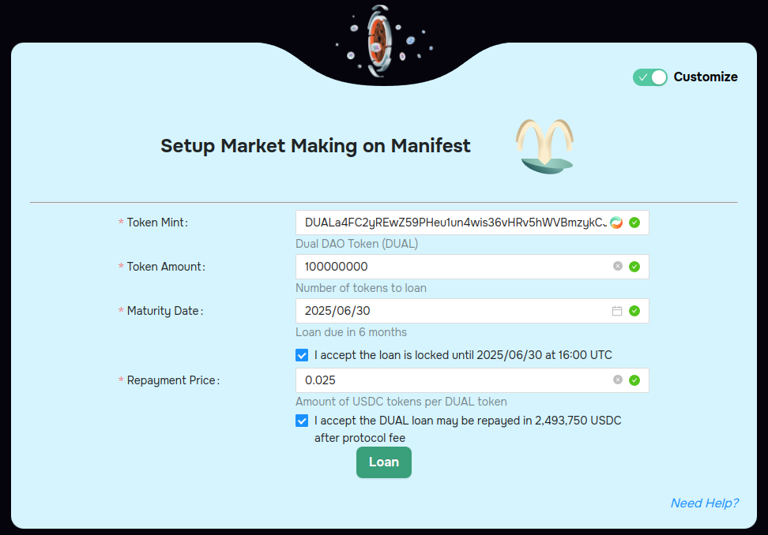

# Loans

Utilize the Dual Finance loan page to create an Openbook V2 market and enable market making.&#x20;


Market Making Loans


<figure><figcaption></figcaption></figure>

Choose between three different pre-configured loans

1. Degen - The shortest loan and least liquidity provided but a useful way to experiment with the service offered and ape in.
2. Launch - Best for pre-launch projects who want some baseline liquidity for their Openbook V2 market but may have limitations on the loan size.
3. Alpha - Full service on-chain liquidity option that concentrates a token's liquidity on-chain rather than on CEXs. Largest loan and longest service period.

Projects only need to select one of the three packages and enter their token mint.

<figure><figcaption></figcaption></figure>

Loans remain fully collateralized at all times so there is no exposure to the market maker, [CKS Systems](https://cks.systems/).  Loans are returnable in the initial tokens provided or in USDC at the repayment price provided. Only if, the loan is returned in USDC is there a 0.0025% fee applied. Otherwise, the market making service is provided without a fee and all tokens are locked until the end of the period.

Market making is provided for the chosen token on [Openbook V2](https://www.openbook.ag/ecosystem), an on-chain orderbook and improved version of Serum. Statistics and performance can be monitored on-chain, including how much of the loan is being utilized.
